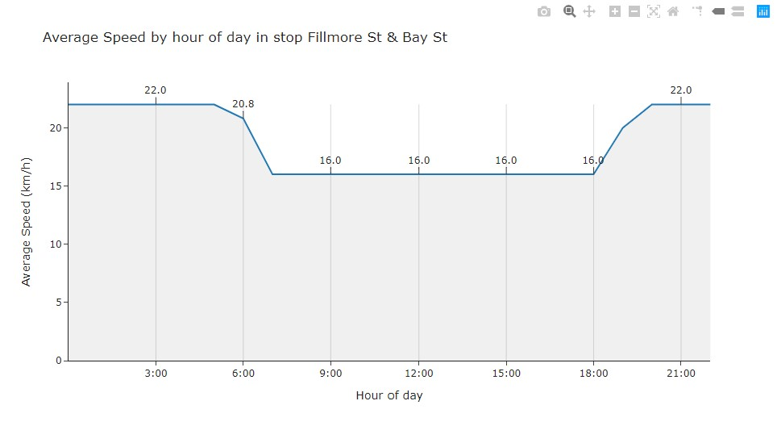

# GTFS functions

This package allows you to create various layers directly from the GTFS and visualize the results in the most straightforward way possible.
It is still in its testing face.

## Table of contents
* [Installation](#installation)
* [GTFS parsing](#gtfs_parsing)
* [Stop frequencies](#stop_freq)
* [Line frequencies](#line_freq)
* [Cut in Bus segments](#cut_gtfs)
* [Speeds](#speeds)
* [Segment frequencies](#seg_freq)
* [Export/Save your work](#save_gdf)
* [Mapping the results](#map_gdf)
* [Other plots](#plotly)

## Installation <a class="anchor" id="installation"></a>


```python
!pip install gtfs_functions
```


```python
import gtfs_functions as gtfs
```

# GTFS Import <a class="anchor" id="gtfs_parsing"></a>

The function `import_gtfs` is a wrapper around `partridge`. It takes the path or the zip file as argument and returns 5 dataframes/geodataframes.


```python
routes, stops, stop_times, trips, shapes = gtfs.import_gtfs(r"C:\Users\santi\Desktop\Articles\SFMTA_GTFS.zip")
```


```python
routes.head(2)
```


<div>
<table border="1" class="dataframe">
  <thead>
    <tr style="text-align: right;">
      <th></th>
      <th>route_id</th>
      <th>agency_id</th>
      <th>route_short_name</th>
      <th>route_long_name</th>
      <th>route_desc</th>
      <th>route_type</th>
      <th>route_url</th>
      <th>route_color</th>
      <th>route_text_color</th>
    </tr>
  </thead>
  <tbody>
    <tr>
      <th>0</th>
      <td>15761</td>
      <td>SFMTA</td>
      <td>1</td>
      <td>CALIFORNIA</td>
      <td></td>
      <td>3</td>
      <td>https://SFMTA.com/1</td>
      <td></td>
      <td></td>
    </tr>
    <tr>
      <th>1</th>
      <td>15766</td>
      <td>SFMTA</td>
      <td>5</td>
      <td>FULTON</td>
      <td></td>
      <td>3</td>
      <td>https://SFMTA.com/5</td>
      <td></td>
      <td></td>
    </tr>
  </tbody>
</table>
</div>


```python
stops.head(2)
```


<table border="1" class="dataframe">
  <thead>
    <tr style="text-align: right;">
      <th></th>
      <th>stop_id</th>
      <th>stop_code</th>
      <th>stop_name</th>
      <th>stop_desc</th>
      <th>zone_id</th>
      <th>stop_url</th>
      <th>geometry</th>
    </tr>
  </thead>
  <tbody>
    <tr>
      <th>0</th>
      <td>390</td>
      <td>10390</td>
      <td>19th Avenue &amp; Holloway St</td>
      <td></td>
      <td></td>
      <td></td>
      <td>POINT (-122.47510 37.72119)</td>
    </tr>
    <tr>
      <th>1</th>
      <td>3016</td>
      <td>13016</td>
      <td>3rd St &amp; 4th St</td>
      <td></td>
      <td></td>
      <td></td>
      <td>POINT (-122.38979 37.77262)</td>
    </tr>
  </tbody>
</table>
</div>


```python
stop_times.head(2)
```


<div>
<table border="1" class="dataframe">
  <thead>
    <tr style="text-align: right;">
      <th></th>
      <th>trip_id</th>
      <th>arrival_time</th>
      <th>departure_time</th>
      <th>stop_id</th>
      <th>stop_sequence</th>
      <th>stop_headsign</th>
      <th>pickup_type</th>
      <th>drop_off_type</th>
      <th>shape_dist_traveled</th>
      <th>route_id</th>
      <th>service_id</th>
      <th>direction_id</th>
      <th>shape_id</th>
      <th>stop_code</th>
      <th>stop_name</th>
      <th>stop_desc</th>
      <th>zone_id</th>
      <th>stop_url</th>
      <th>geometry</th>
    </tr>
  </thead>
  <tbody>
    <tr>
      <th>0</th>
      <td>9413147</td>
      <td>81840.0</td>
      <td>81840.0</td>
      <td>4015</td>
      <td>1</td>
      <td></td>
      <td>NaN</td>
      <td></td>
      <td>NaN</td>
      <td>15761</td>
      <td>1</td>
      <td>0</td>
      <td>179928</td>
      <td>14015</td>
      <td>Clay St &amp; Drumm St</td>
      <td></td>
      <td></td>
      <td></td>
      <td>POINT (-122.39682 37.79544)</td>
    </tr>
    <tr>
      <th>1</th>
      <td>9413147</td>
      <td>81902.0</td>
      <td>81902.0</td>
      <td>6294</td>
      <td>2</td>
      <td></td>
      <td>NaN</td>
      <td></td>
      <td>NaN</td>
      <td>15761</td>
      <td>1</td>
      <td>0</td>
      <td>179928</td>
      <td>16294</td>
      <td>Sacramento St &amp; Davis St</td>
      <td></td>
      <td></td>
      <td></td>
      <td>POINT (-122.39761 37.79450)</td>
    </tr>
  </tbody>
</table>
</div>


```python
trips.head(2)
```


<div>
<table border="1" class="dataframe">
  <thead>
    <tr style="text-align: right;">
      <th></th>
      <th>trip_id</th>
      <th>route_id</th>
      <th>service_id</th>
      <th>direction_id</th>
      <th>shape_id</th>
    </tr>
  </thead>
  <tbody>
    <tr>
      <th>0</th>
      <td>9547346</td>
      <td>15804</td>
      <td>1</td>
      <td>0</td>
      <td>180140</td>
    </tr>
    <tr>
      <th>1</th>
      <td>9547345</td>
      <td>15804</td>
      <td>1</td>
      <td>0</td>
      <td>180140</td>
    </tr>
  </tbody>
</table>
</div>


```python
shapes.head(2)
```


<div>
<table border="1" class="dataframe">
  <thead>
    <tr style="text-align: right;">
      <th></th>
      <th>shape_id</th>
      <th>geometry</th>
    </tr>
  </thead>
  <tbody>
    <tr>
      <th>0</th>
      <td>179928</td>
      <td>LINESTRING (-122.39697 37.79544, -122.39678 37...</td>
    </tr>
    <tr>
      <th>1</th>
      <td>179929</td>
      <td>LINESTRING (-122.39697 37.79544, -122.39678 37...</td>
    </tr>
  </tbody>
</table>
</div>


# Stop frequencies <a class="anchor" id="stop_freq"></a>

This function will create a geodataframe with the frequency for each combination of `stop`, `time of day` and `direction`. Each row with a **Point** geometry. The `stops_freq` function takes `stop_times` and `stops` created in the previous steps as arguments. The user can optionally specify `cutoffs` as a list in case the default is not good. These `cutoffs` are the times of days to use as aggregation.


```python
cutoffs = [0,6,9,15.5,19,22,24]
stop_freq = gtfs.stops_freq(stop_times, stops, cutoffs = cutoffs)
stop_freq.head(2)
```


<div>
<table border="1" class="dataframe">
  <thead>
    <tr style="text-align: right;">
      <th></th>
      <th>stop_id</th>
      <th>dir_id</th>
      <th>window</th>
      <th>ntrips</th>
      <th>frequency</th>
      <th>max_trips</th>
      <th>max_freq</th>
      <th>stop_name</th>
      <th>geometry</th>
    </tr>
  </thead>
  <tbody>
    <tr>
      <th>8157</th>
      <td>5763</td>
      <td>Inbound</td>
      <td>0:00-6:00</td>
      <td>1</td>
      <td>360</td>
      <td>5</td>
      <td>12</td>
      <td>Noriega St &amp; 48th Ave</td>
      <td>POINT (-122.50785 37.75293)</td>
    </tr>
    <tr>
      <th>13102</th>
      <td>7982</td>
      <td>Outbound</td>
      <td>0:00-6:00</td>
      <td>1</td>
      <td>360</td>
      <td>3</td>
      <td>20</td>
      <td>Moscow St &amp; RussiaAvet</td>
      <td>POINT (-122.42996 37.71804)</td>
    </tr>
    <tr>
      <th>9539</th>
      <td>6113</td>
      <td>Inbound</td>
      <td>0:00-6:00</td>
      <td>1</td>
      <td>360</td>
      <td>5</td>
      <td>12</td>
      <td>Portola Dr &amp; Laguna Honda Blvd</td>
      <td>POINT (-122.45526 37.74310)</td>
    </tr>
    <tr>
      <th>12654</th>
      <td>7719</td>
      <td>Inbound</td>
      <td>0:00-6:00</td>
      <td>1</td>
      <td>360</td>
      <td>5</td>
      <td>12</td>
      <td>Middle Point &amp; Acacia</td>
      <td>POINT (-122.37952 37.73707)</td>
    </tr>
    <tr>
      <th>9553</th>
      <td>6116</td>
      <td>Inbound</td>
      <td>0:00-6:00</td>
      <td>1</td>
      <td>360</td>
      <td>5</td>
      <td>12</td>
      <td>Portola Dr &amp; San Pablo Ave</td>
      <td>POINT (-122.46107 37.74040)</td>
    </tr>
  </tbody>
</table>
</div>


# Line frequencies <a class="anchor" id="line_freq"></a>

This function will create a geodataframe with the frequency for each combination of `line`, `time of day` and `direction`. Each row with a **LineString** geometry. The `line_freq` function takes `stop_times`, `trips`, `shapes`, `routes` created in the previous steps as arguments. The user can optionally specify `cutoffs` as a list in case the default is not good. These `cutoffs` are the times of days to use as aggregation.


```python
cutoffs = [0,6,9,15.5,19,22,24]
line_freq = gtfs.lines_freq(stop_times, trips, shapes, routes, cutoffs = cutoffs)
line_freq.head()
```


<div>
<table border="1" class="dataframe">
  <thead>
    <tr style="text-align: right;">
      <th></th>
      <th>route_id</th>
      <th>route_name</th>
      <th>dir_id</th>
      <th>window</th>
      <th>frequency</th>
      <th>ntrips</th>
      <th>max_freq</th>
      <th>max_trips</th>
      <th>geometry</th>
    </tr>
  </thead>
  <tbody>
    <tr>
      <th>376</th>
      <td>15808</td>
      <td>44 O'SHAUGHNESSY</td>
      <td>Inbound</td>
      <td>0:00-6:00</td>
      <td>360</td>
      <td>1</td>
      <td>12</td>
      <td>5</td>
      <td>LINESTRING (-122.46459 37.78500, -122.46352 37...</td>
    </tr>
    <tr>
      <th>378</th>
      <td>15808</td>
      <td>44 O'SHAUGHNESSY</td>
      <td>Inbound</td>
      <td>0:00-6:00</td>
      <td>360</td>
      <td>1</td>
      <td>12</td>
      <td>5</td>
      <td>LINESTRING (-122.43416 37.73355, -122.43299 37...</td>
    </tr>
    <tr>
      <th>242</th>
      <td>15787</td>
      <td>25 TREASURE ISLAND</td>
      <td>Inbound</td>
      <td>0:00-6:00</td>
      <td>360</td>
      <td>1</td>
      <td>15</td>
      <td>4</td>
      <td>LINESTRING (-122.39611 37.79013, -122.39603 37...</td>
    </tr>
    <tr>
      <th>451</th>
      <td>15814</td>
      <td>54 FELTON</td>
      <td>Inbound</td>
      <td>0:00-6:00</td>
      <td>360</td>
      <td>1</td>
      <td>20</td>
      <td>3</td>
      <td>LINESTRING (-122.38845 37.73994, -122.38844 37...</td>
    </tr>
    <tr>
      <th>241</th>
      <td>15787</td>
      <td>25 TREASURE ISLAND</td>
      <td>Inbound</td>
      <td>0:00-6:00</td>
      <td>360</td>
      <td>1</td>
      <td>15</td>
      <td>4</td>
      <td>LINESTRING (-122.39542 37.78978, -122.39563 37...</td>
    </tr>
  </tbody>
</table>
</div>


# Bus segments <a class="anchor" id="cut_gtfs"></a>

The function `cut_gtfs` takes `stop_times`, `stops`, and `shapes` created by `import_gtfs` as arguments and returns a geodataframe where each segment is a row and has a **LineString** geometry.


```python
segments_gdf = gtfs.cut_gtfs(stop_times, stops, shapes)
segments_gdf.head(2)
```


<div>
<table border="1" class="dataframe">
  <thead>
    <tr style="text-align: right;">
      <th></th>
      <th>route_id</th>
      <th>direction_id</th>
      <th>stop_sequence</th>
      <th>start_stop_name</th>
      <th>end_stop_name</th>
      <th>start_stop_id</th>
      <th>end_stop_id</th>
      <th>segment_id</th>
      <th>shape_id</th>
      <th>geometry</th>
      <th>distance_m</th>
    </tr>
  </thead>
  <tbody>
    <tr>
      <th>0</th>
      <td>15761</td>
      <td>0</td>
      <td>1</td>
      <td>Clay St &amp; Drumm St</td>
      <td>Sacramento St &amp; Davis St</td>
      <td>4015</td>
      <td>6294</td>
      <td>4015-6294</td>
      <td>179928</td>
      <td>LINESTRING (-122.39697 37.79544, -122.39678 37...</td>
      <td>205.281653</td>
    </tr>
    <tr>
      <th>1</th>
      <td>15761</td>
      <td>0</td>
      <td>2</td>
      <td>Sacramento St &amp; Davis St</td>
      <td>Sacramento St &amp; Battery St</td>
      <td>6294</td>
      <td>6290</td>
      <td>6294-6290</td>
      <td>179928</td>
      <td>LINESTRING (-122.39761 37.79446, -122.39781 37...</td>
      <td>238.047505</td>
    </tr>
  </tbody>
</table>
</div>


# Scheduled Speeds <a class="anchor" id="speeds"></a>

This function will create a geodataframe with the `speed_kmh` and `speed_mph` for each combination of `line`, `segment`, `time of day` and `direction`. Each row with a **LineString** geometry. The function `speeds_from_gtfs` takes `routes`, `stop_times` and `segments_gdf` created in the previous steps as arguments. The user can optionally specify `cutoffs` as a list in case the default is not good. These `cutoffs` are the times of days to use as aggregation.


```python
# Cutoffs to make get hourly values
cutoffs = list(range(24))
speeds = speeds_from_gtfs(routes, stop_times, segments_gdf, cutoffs = cutoffs)
speeds.head(1)
```


<div>
<table border="1" class="dataframe">
  <thead>
    <tr style="text-align: right;">
      <th></th>
      <th>route_id</th>
      <th>route_name</th>
      <th>dir_id</th>
      <th>segment_id</th>
      <th>window</th>
      <th>speed_kmh</th>
      <th>s_st_id</th>
      <th>s_st_name</th>
      <th>e_st_id</th>
      <th>e_st_name</th>
      <th>distance_m</th>
      <th>stop_seq</th>
      <th>runtime_h</th>
      <th>max_kmh</th>
      <th>geometry</th>
      <th>speed_mph</th>
      <th>max_mph</th>
    </tr>
  </thead>
  <tbody>
    <tr>
      <th>0</th>
      <td>15761</td>
      <td>1 CALIFORNIA</td>
      <td>Inbound</td>
      <td>4015-6294</td>
      <td>10:00-11:00</td>
      <td>12.0</td>
      <td>4015</td>
      <td>Clay St &amp; Drumm St</td>
      <td>6294</td>
      <td>Sacramento St &amp; Davis St</td>
      <td>205.281653</td>
      <td>1</td>
      <td>0.017222</td>
      <td>12.0</td>
      <td>LINESTRING (-122.39697 37.79544, -122.39678 37...</td>
      <td>7.456452</td>
      <td>7.456452</td>
    </tr>
  </tbody>
</table>
</div>


```python
speeds.loc[(speeds.segment_id=='3114-3144')&(speeds.window=='0:00-6:00')]
```


<div>
<table border="1" class="dataframe">
  <thead>
    <tr style="text-align: right;">
      <th></th>
      <th>route_id</th>
      <th>route_name</th>
      <th>dir_id</th>
      <th>segment_id</th>
      <th>window</th>
      <th>speed_kmh</th>
      <th>s_st_id</th>
      <th>s_st_name</th>
      <th>e_st_id</th>
      <th>e_st_name</th>
      <th>distance_m</th>
      <th>stop_seq</th>
      <th>runtime_h</th>
      <th>max_kmh</th>
      <th>geometry</th>
      <th>speed_mph</th>
      <th>max_mph</th>
    </tr>
  </thead>
  <tbody>
    <tr>
      <th>11183</th>
      <td>15792</td>
      <td>30 STOCKTON</td>
      <td>Inbound</td>
      <td>3114-3144</td>
      <td>0:00-6:00</td>
      <td>12.8</td>
      <td>3114</td>
      <td>3rd St &amp; Brannan St</td>
      <td>3144</td>
      <td>3rd St &amp; Bryant St</td>
      <td>373.952483</td>
      <td>2</td>
      <td>0.028565</td>
      <td>13.0</td>
      <td>LINESTRING (-122.39323 37.77923, -122.39431 37...</td>
      <td>7.953549</td>
      <td>8.077823</td>
    </tr>
    <tr>
      <th>16862</th>
      <td>15809</td>
      <td>45 UNION-STOCKTON</td>
      <td>Inbound</td>
      <td>3114-3144</td>
      <td>0:00-6:00</td>
      <td>13.0</td>
      <td>3114</td>
      <td>3rd St &amp; Brannan St</td>
      <td>3144</td>
      <td>3rd St &amp; Bryant St</td>
      <td>373.952483</td>
      <td>2</td>
      <td>0.027778</td>
      <td>13.0</td>
      <td>LINESTRING (-122.39323 37.77923, -122.39431 37...</td>
      <td>8.077823</td>
      <td>8.077823</td>
    </tr>
    <tr>
      <th>19889</th>
      <td>15831</td>
      <td>91 3RD-19TH AVE OWL</td>
      <td>Outbound</td>
      <td>3114-3144</td>
      <td>0:00-6:00</td>
      <td>17.0</td>
      <td>3114</td>
      <td>3rd St &amp; Brannan St</td>
      <td>3144</td>
      <td>3rd St &amp; Bryant St</td>
      <td>373.952483</td>
      <td>56</td>
      <td>0.021667</td>
      <td>17.0</td>
      <td>LINESTRING (-122.39323 37.77923, -122.39431 37...</td>
      <td>10.563307</td>
      <td>10.563307</td>
    </tr>
    <tr>
      <th>22823</th>
      <td>ALL_LINES</td>
      <td>All lines</td>
      <td>NA</td>
      <td>3114-3144</td>
      <td>0:00-6:00</td>
      <td>15.2</td>
      <td>3114</td>
      <td>3rd St &amp; Brannan St</td>
      <td>3144</td>
      <td>3rd St &amp; Bryant St</td>
      <td>373.952483</td>
      <td>2</td>
      <td>0.024511</td>
      <td>NaN</td>
      <td>LINESTRING (-122.39323 37.77923, -122.39431 37...</td>
      <td>9.444839</td>
      <td>NaN</td>
    </tr>
  </tbody>
</table>
</div>


# Segment frequencies <a class="anchor" id="seg_freq"></a>


```python
cutoffs = [0,6,9,15.5,19,22,24]
seg_freq = gtfs.segments_freq(segments_gdf, stop_times, routes, cutoffs = cutoffs)
seg_freq.head(2)
```


<div>
<table border="1" class="dataframe">
  <thead>
    <tr style="text-align: right;">
      <th></th>
      <th>route_id</th>
      <th>route_name</th>
      <th>dir_id</th>
      <th>segment_id</th>
      <th>window</th>
      <th>frequency</th>
      <th>ntrips</th>
      <th>s_st_id</th>
      <th>s_st_name</th>
      <th>e_st_name</th>
      <th>max_freq</th>
      <th>max_trips</th>
      <th>geometry</th>
    </tr>
  </thead>
  <tbody>
    <tr>
      <th>23191</th>
      <td>ALL_LINES</td>
      <td>All lines</td>
      <td>NA</td>
      <td>3628-3622</td>
      <td>0:00-6:00</td>
      <td>360</td>
      <td>1</td>
      <td>3628</td>
      <td>Alemany Blvd &amp; St Charles Ave</td>
      <td>Alemany Blvd &amp; Arch St</td>
      <td>20</td>
      <td>18</td>
      <td>LINESTRING (-122.46949 37.71045, -122.46941 37...</td>
    </tr>
    <tr>
      <th>6160</th>
      <td>15787</td>
      <td>25 TREASURE ISLAND</td>
      <td>Inbound</td>
      <td>7948-8017</td>
      <td>0:00-6:00</td>
      <td>360</td>
      <td>1</td>
      <td>7948</td>
      <td>Transit Center Bay 29</td>
      <td>Shoreline Access Road</td>
      <td>15</td>
      <td>4</td>
      <td>LINESTRING (-122.39611 37.79013, -122.39603 37...</td>
    </tr>
  </tbody>
</table>
</div>


```python
seg_freq.loc[(seg_freq.segment_id=='3114-3144')&(seg_freq.window=='0:00-6:00')]
```


<div>
<table border="1" class="dataframe">
  <thead>
    <tr style="text-align: right;">
      <th></th>
      <th>route_id</th>
      <th>route_name</th>
      <th>dir_id</th>
      <th>segment_id</th>
      <th>window</th>
      <th>frequency</th>
      <th>ntrips</th>
      <th>s_st_id</th>
      <th>s_st_name</th>
      <th>e_st_name</th>
      <th>max_freq</th>
      <th>max_trips</th>
      <th>geometry</th>
    </tr>
  </thead>
  <tbody>
    <tr>
      <th>10566</th>
      <td>15809</td>
      <td>45 UNION-STOCKTON</td>
      <td>Inbound</td>
      <td>3114-3144</td>
      <td>0:00-6:00</td>
      <td>120</td>
      <td>3</td>
      <td>3114</td>
      <td>3rd St &amp; Brannan St</td>
      <td>3rd St &amp; Bryant St</td>
      <td>12</td>
      <td>5</td>
      <td>LINESTRING (-122.39323 37.77923, -122.39431 37...</td>
    </tr>
    <tr>
      <th>7604</th>
      <td>15792</td>
      <td>30 STOCKTON</td>
      <td>Inbound</td>
      <td>3114-3144</td>
      <td>0:00-6:00</td>
      <td>60</td>
      <td>6</td>
      <td>3114</td>
      <td>3rd St &amp; Brannan St</td>
      <td>3rd St &amp; Bryant St</td>
      <td>12</td>
      <td>5</td>
      <td>LINESTRING (-122.39323 37.77923, -122.39431 37...</td>
    </tr>
    <tr>
      <th>13209</th>
      <td>15831</td>
      <td>91 3RD-19TH AVE OWL</td>
      <td>Outbound</td>
      <td>3114-3144</td>
      <td>0:00-6:00</td>
      <td>30</td>
      <td>12</td>
      <td>3114</td>
      <td>3rd St &amp; Brannan St</td>
      <td>3rd St &amp; Bryant St</td>
      <td>30</td>
      <td>2</td>
      <td>LINESTRING (-122.39323 37.77923, -122.39431 37...</td>
    </tr>
    <tr>
      <th>16580</th>
      <td>ALL_LINES</td>
      <td>All lines</td>
      <td>NA</td>
      <td>3114-3144</td>
      <td>0:00-6:00</td>
      <td>17</td>
      <td>21</td>
      <td>3114</td>
      <td>3rd St &amp; Brannan St</td>
      <td>3rd St &amp; Bryant St</td>
      <td>5</td>
      <td>59</td>
      <td>LINESTRING (-122.39323 37.77923, -122.39431 37...</td>
    </tr>
  </tbody>
</table>
</div>


# Save files <a class="anchor" id="save_gdf"></a>


```python
file_name = 'stop_frequencies'
gtfs.save_gdf(stop_frequencies_gdf, file_name, shapefile=True, geojson=True)
```

# Map your work <a class="anchor" id="map_gdf"></a>

## Stop frequencies
```python
# Stops
condition_dir = stop_freq.dir_id == 'Inbound'
condition_window = stop_freq.window == '6:00-9:00'

gdf = stop_freq.loc[(condition_dir & condition_window),:].reset_index()

gtfs.map_gdf(gdf = gdf, 
              variable = 'ntrips', 
              colors = ["#d13870", "#e895b3" ,'#55d992', '#3ab071', '#0e8955','#066a40'], 
              tooltip_var = ['frequency'] , 
              tooltip_labels = ['Frequency: '], 
              breaks = [10, 20, 30, 40, 120, 200])
```


## Line frequencies
```python
# Line frequencies
condition_dir = line_freq.dir_id == 'Inbound'
condition_window = line_freq.window == '6:00-9:00'

gdf = line_freq.loc[(condition_dir & condition_window),:].reset_index()

gtfs.map_gdf(gdf = gdf, 
              variable = 'ntrips', 
              colors = ["#d13870", "#e895b3" ,'#55d992', '#3ab071', '#0e8955','#066a40'], 
              tooltip_var = ['route_name'] , 
              tooltip_labels = ['Route: '], 
              breaks = [5, 10, 20, 50])
```


## Speeds
If you are looking to visualize data at the segment level for all lines I recommend you go with something more powerful like kepler.gl (AKA my favorite data viz library). For example, to check the scheduled speeds per segment:
```python
# Speeds
import keplergl as kp
m = kp.KeplerGl(data=dict(data=speeds, name='Speed Lines'), height=400)
m
```


## Segment frequencies
```python
# Segment frequencies
import keplergl as kp
m = kp.KeplerGl(data=dict(data=seg_freq, name='Segment frequency'), height=400)
m
```


# Other plots <a class="anchor" id="plotly"></a>
## Histogram
```python
# Histogram
import plotly.express as px
px.histogram(
    stop_freq.loc[stop_freq.frequency<50], 
    x='frequency', 
    title='Stop frequencies',
    template='simple_white', 
    nbins =20)
```


## Heatmap
```python
# Heatmap
import plotly.graph_objects as go
dir_0 = speeds.loc[(speeds.dir_id=='Inbound')&(speeds.route_name=='1 CALIFORNIA')].sort_values(by='stop_seq') 
dir_0['hour'] = dir_0.window.apply(lambda x: int(x.split(':')[0]))
dir_0.sort_values(by='hour', ascending=True, inplace=True)

fig = go.Figure(data=go.Heatmap(
                   z=dir_0.speed_kmh,
                   y=dir_0.s_st_name,
                   x=dir_0.window,
                   hoverongaps = False,
                   colorscale=px.colors.colorbrewer.RdYlBu, 
                   reversescale=False
))

fig.update_yaxes(title_text='Stop', autorange='reversed')
fig.update_xaxes(title_text='Hour of day', side='top')
fig.update_layout(showlegend=False, height=600, width=1000,
                 title='Speed heatmap per direction and hour of the day')

fig.show()
```


## Line chart
```python
by_hour = speeds.pivot_table('speed_kmh', index = ['window'], aggfunc = ['mean','std'] ).reset_index()
by_hour.columns = ['_'.join(col).strip() for col in by_hour.columns.values]
by_hour['hour'] = by_hour.window_.apply(lambda x: int(x.split(':')[0]))
by_hour.sort_values(by='hour', ascending=True, inplace=True)

# Scatter
fig = px.line(by_hour, 
           x='window_', 
           y='mean_speed_kmh', 
           template='simple_white', 
           #error_y = 'std_speed_kmh'
                )

fig.update_yaxes(rangemode='tozero')

fig.show()
```


## Fancy line chart
```python
# Line graphs
import plotly.graph_objects as go
example2 = speeds.loc[(speeds.s_st_name=='Fillmore St & Bay St')&(speeds.route_name=='All lines')].sort_values(by='stop_seq') 
example2['hour'] = example2.window.apply(lambda x: int(x.split(':')[0]))
example2.sort_values(by='hour', ascending=True, inplace=True)

fig = go.Figure()

trace = go.Scatter(
    name='Speed',
    x=example2.hour, 
    y=example2.speed_kmh,
    mode='lines',
    line=dict(color='rgb(31, 119, 180)'),
    fillcolor='#F0F0F0',
    fill='tonexty',
    opacity = 0.5)


data = [trace]

layout = go.Layout(
    yaxis=dict(title='Average Speed (km/h)'),
    xaxis=dict(title='Hour of day'),
    title='Average Speed by hour of day in stop Fillmore St & Bay St',
    showlegend = False, template = 'simple_white')

fig = go.Figure(data=data, layout=layout)

# Get the labels in the X axis right
axes_labels = [] 
tickvals=example2.hour.unique()[::3][1:]

for i in range(0, len(tickvals)):
    label = str(tickvals[i]) + ':00'
    axes_labels.append(label)

fig.update_xaxes(
    ticktext=axes_labels,
    tickvals=tickvals
)

# Add vertical lines
y_max_value = example2.speed_kmh.max()

for i in range(0, len(tickvals)):
    fig.add_shape(
        # Line Vertical
        dict(
            type="line",
            x0=tickvals[i],
            y0=0,
            x1=tickvals[i],
            y1=y_max_value,
            line=dict(
                color="Grey",
                width=1
            )
        )
    )
    
# Labels in the edge values
for i in range(0, len(tickvals)):    
    y_value = example2.loc[example2.hour==tickvals[i], 'speed_kmh'].values[0].round(2)
    fig.add_annotation(
        x=tickvals[i],
        y=y_value,
        text=str(y_value),
    )
fig.update_annotations(dict(
            xref="x",
            yref="y",
            showarrow=True,
            arrowhead=0,
            ax=0,
            ay=-18
))

fig.update_yaxes(rangemode='tozero')

fig.show()
```

